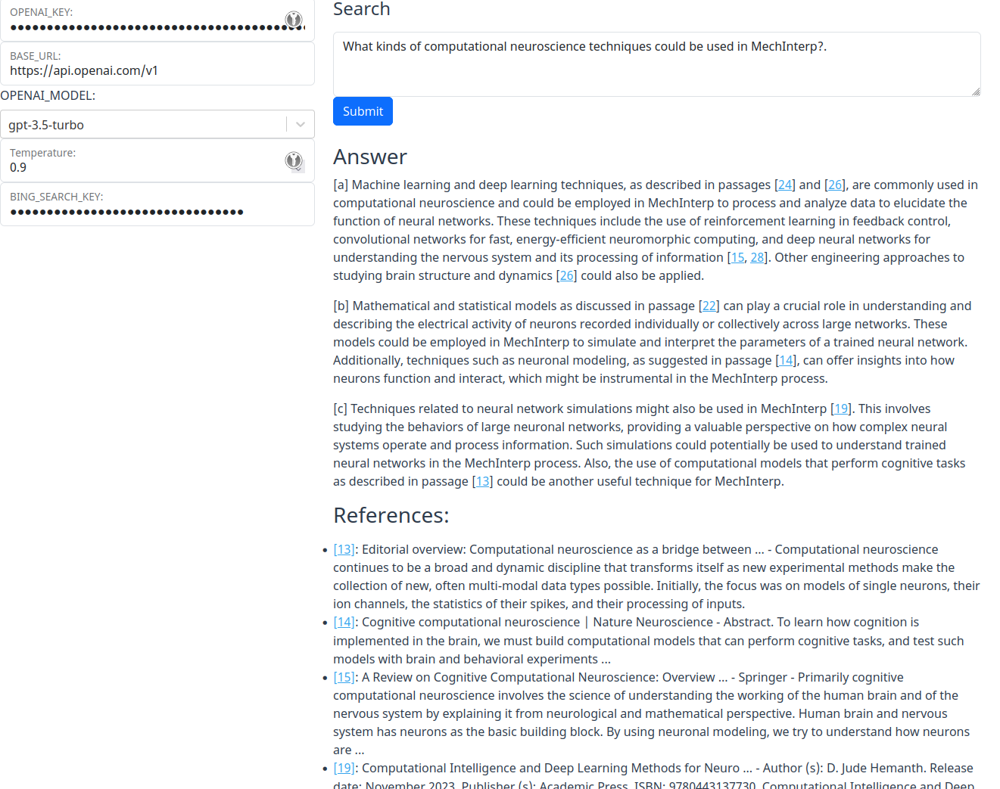

# rag_search_cite

rag_search_cite: Hackable frontend only LLM assisted searching with citations


# demo

~~[demo]()~~



# run

```npm
npm run dev
```

# notes

- for editor styling 
  - <https://flowbite.com/docs/forms/textarea/#wysiwyg-editor>
  - <https://tailwindcss.com/docs/dark-mode>
- deploy: <https://vitejs.dev/guide/static-deploy#github-pages>

